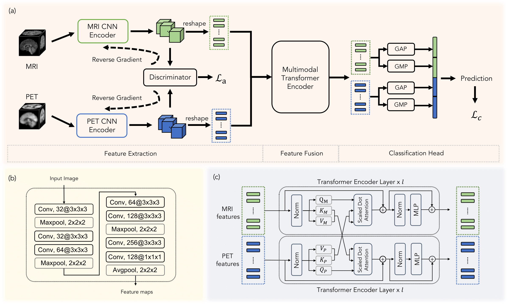

# ADScreen · 阿尔兹海默病多模态影像智能筛查与干预平台

> 基于 TransMF（Transformer 多模态融合）算法的 AD 早期筛查全栈平台：结构 MRI + PET 影像融合推理 → NIA-AA 标准诊断报告 → 全流程病例/报告/数据分析/患者管理闭环。

面向放射科医师、神经内科医师、科研管理员与超级管理员四类角色，提供从影像阅片、AI 辅助诊断、报告生成、病例管理到多中心科研分析的一站式工作台。

## 目录

- [技术栈](#技术栈)
- [功能概览](#功能概览)
- [目录结构](#目录结构)
- [快速启动](#快速启动)
- [演示账号](#演示账号)
- [配置与环境变量](#配置与环境变量)
- [数据安全声明](#数据安全声明)
- [算法来源](#算法来源)

## 技术栈

**前端**：Vue 3 + TypeScript + Vite + Element Plus + Tailwind CSS + ECharts + Three.js + Pinia + Vue Router + Axios

**后端**：FastAPI + SQLAlchemy ORM + JWT 鉴权 + SQLite + Pydantic + Uvicorn

**AI 模型**：PyTorch 实现的 TransMF 多模态融合网络（结构 MRI + PET），训练与推理脚本保留在仓库根目录

## 功能概览

平台围绕 AD 筛查临床与科研全流程，分为以下模块：

1. **多模态影像阅片**：MPR 三平面联动（轴/矢/冠）、Grad-CAM 热力图叠加、Three.js 3D 体绘制、Canvas ROI 标注工具（球形/矩形/多边形，面积 mm² 量化）
2. **AI 辅助诊断**：TransMF 多模态融合推理（SSE 流式进度）、7 大类结果呈现——NIA-AA 标准分期、患者版通俗文案、6 维雷达图、相似病例 Top-K、认知趋势、异常脑区热力图、矛盾证据提示
3. **病例管理**：列表/详情、高级多维筛选（诊断状态/科室/性别/年龄/是否随访）、批量 AI 分析异步任务队列（进度轮询）、评论会诊讨论、相似病例、患者全景档案（风险趋势/认知/时间线）、队列纵向轨迹对比（最多 8 名）
4. **报告系统**：4 套模板（简版/详版/科研版/患者版）、NIA-AA 对齐、医生版/患者版一键切换、模板字段可视化管理、html2canvas + jsPDF 导出
5. **数据分析**：多中心队列对比、模型性能监控与漂移检测（PSI + KS 统计量）、风险因子关联分析（皮尔逊矩阵 + 回归）、临床路径桑基图、认知趋势、科研数据集导出（CSV/JSON）
6. **患者管理**：随访月历（列表/日历视图）、高危预警中心（逾期/MMSE 年化/AI 风险上升三类，处置闭环）、干预记录
7. **影像质控**：6 规则自动质控（模态缺失/文件缺失/信息不全/重复/停滞/审核异常）
8. **患者教育**：AD 科普知识库（6 分类 Markdown，无鉴权公开访问）
9. **系统管理**：用户审核、角色权限配置、操作审计日志、运行审计看板（登录/活跃用户/病例动作/失败时段）、登录日志
10. **个人中心**：资料/密码、临床工作统计、活动记录、登录记录
11. **登录注册**：角色选择注册、图形验证码、登录防爆破（失败锁定）、JWT token 版本号登出
12. **标准互操作**：FHIR R4 导出（Patient / ImagingStudy / Observation / DiagnosticReport / AuditEvent / Bundle）与 DICOMweb 只读检索（QIDO-RS studies/series/instances、WADO-RS metadata），供 EHR、PACS、区域平台以标准协议对接，无需私有适配器
13. **合规审计追踪**：全量写操作与 PHI 读操作自动留痕（谁/何时/何 IP/对哪位患者/做了什么/成功与否），哈希链防篡改 + 数据库级 append-only 触发器，支持按患者检索访问史、完整性校验与 FHIR AuditEvent 导出供 SIEM 采集

## 目录结构

```
TransMF_AD-master/
├── ad-screen-frontend/          # 前端（Vue 3 + Vite）
│   ├── src/
│   │   ├── api/                 # 接口封装（axios + mock 分支）
│   │   ├── components/          # 通用组件
│   │   ├── layouts/             # 布局
│   │   ├── router/              # 路由
│   │   ├── stores/              # Pinia 状态
│   │   ├── styles/              # 全局样式
│   │   ├── types/               # TypeScript 类型
│   │   ├── utils/               # 工具函数
│   │   └── views/               # 页面
│   └── package.json
├── ad-screen-backend/           # 后端（FastAPI + SQLAlchemy）
│   ├── models/                  # ORM 模型
│   ├── routers/                 # 路由（30+ 模块）
│   ├── schemas/                 # Pydantic 模型
│   ├── services/                # 业务服务
│   ├── backups/                 # 数据库备份（不入库）
│   ├── logs/                    # 日志（不入库）
│   ├── config.py                # 配置
│   ├── database.py              # 数据库初始化
│   └── main.py                  # FastAPI 入口
├── datasets/                    # 数据集（图像不入库）
│   └── ADNI.csv                 # 标签文件
├── docs/
│   └── reports/                 # 归档报告（CSV/md）
├── kfold_train_*.py              # TransMF 训练脚本
├── diag_*.py                     # 诊断脚本
├── models/                       # 算法模型层（训练用，保留原位）
├── .env.example                  # 后端环境变量示例
└── .gitignore
```

## 快速启动

### 后端（:8000）

```bash
cd ad-screen-backend
python -m venv .venv
.venv\Scripts\activate         # Windows；Linux/macOS: source .venv/bin/activate
pip install -r requirements.txt
copy ..\.env.example .env      # Windows；Linux: cp ../.env.example .env
uvicorn main:app --reload --port 8000
```

首次启动会自动创建 SQLite 数据库、初始化表结构并填充演示数据。

> **深度学习依赖（可选）**：默认走模拟推理，业务功能全可用，无需 PyTorch。
> 需要加载 checkpoints 做真实 TransMF 集成推理时再装：
> `pip install -r requirements-ml.txt`（GPU 请先按官方指引装对应 CUDA 版 torch）。

> **生产部署**：`ADSCREEN_ENV=production` 时演示数据默认关闭，管理员初始口令由
> `ADSCREEN_ADMIN_PASSWORD` 指定，未设置则随机生成并在启动日志打印一次。

### 前端（:5173）

```bash
cd ad-screen-frontend
npm install
copy .env.example .env.development   # Windows；Linux: cp .env.example .env.development
npm run dev
```

浏览器访问 http://localhost:5173 即可。

> 开发阶段前端通过 Vite proxy 将 `/api` 转发到后端 :8000，无需额外配置跨域。

## 测试与 CI

```bash
# 后端：静态检查 + 103 项测试
cd ad-screen-backend
ruff check --select=E9,F63,F7,F82,F401,E711,E712 .
python -m pytest tests/ -q

# 前端：类型检查 + 生产构建
cd ad-screen-frontend
npm run typecheck
npm run build
```

GitHub Actions（`.github/workflows/ci.yml`）在每次推送/PR 自动执行上述检查：
后端矩阵覆盖 Python 3.11 / 3.12，前端 Node 20。

## 演示账号

| 角色 | 用户名 | 密码 | 说明 |
| --- | --- | --- | --- |
| 超级管理员 | admin | admin123 | 全功能，含系统管理 |
| 放射科医师 | rad01 | 123456 | 影像阅片/报告/标注 |
| 神经内科医师 | neu01 | 123456 | 诊断/随访/干预 |
| 科研管理员 | sci01 | 123456 | 数据分析/模型监控/导出 |

> 新注册账号默认进入审核流（status=2），需管理员审核后激活；管理员账号仅能在系统管理内创建，注册接口不开放 admin 角色。

## 配置与环境变量

环境变量示例见根目录 [`.env.example`](.env.example) 与前端 [`ad-screen-frontend/.env.example`](ad-screen-frontend/.env.example)，复制为 `.env` / `.env.development` 后按需修改。

**后端关键变量**：

| 变量 | 默认 | 说明 |
| --- | --- | --- |
| `ADSCREEN_ENV` | development | 运行环境，production 强制安全校验 |
| `ADSCREEN_SECRET_KEY` | 内置开发密钥 | JWT 密钥，生产必填且 ≥32 字符（公开占位密钥会被拒绝） |
| `ADSCREEN_DB_PATH` | ad-screen-backend/ad_screen.db | SQLite 路径 |
| `ADSCREEN_CORS_ORIGINS` | localhost 白名单 | 逗号分隔的跨域白名单 |
| `ADSCREEN_TOKEN_EXPIRE_MINUTES` | 720 | Token 过期（分钟），默认 12h |
| `ADSCREEN_LOGIN_MAX_FAILS` | 5 | 连续登录失败锁定阈值 |
| `ADSCREEN_LOGIN_LOCK_MINUTES` | 15 | 锁定时长（分钟） |
| `ADSCREEN_SEED_DEMO_DATA` | dev=1 / prod=0 | 是否填充演示账号与病例；关闭时仅建管理员 |
| `ADSCREEN_ADMIN_PASSWORD` | 随机生成 | 关闭演示数据时的管理员初始密码（随机口令仅打印一次） |
| `ADSCREEN_GLOBAL_RATE_LIMIT` | 600 | 每 IP 每分钟全局请求上限（0=关闭） |
| `ADSCREEN_GLOBAL_RATE_WINDOW_SEC` | 60 | 全局限流滑动窗口长度（秒） |
| `ADSCREEN_SQLITE_BUSY_TIMEOUT_MS` | 5000 | SQLite 争锁等待毫秒（配合 WAL 防 `database is locked`） |
| `ADSCREEN_SQLITE_SYNCHRONOUS` | NORMAL | SQLite 同步策略（OFF/NORMAL/FULL/EXTRA） |
| `ADSCREEN_AUDIT_ENABLED` | 1 | 自动审计中间件开关（0 关闭） |
| `ADSCREEN_AUDIT_RETENTION_DAYS` | 2190 | 审计日志保留天数（HIPAA 下限 6 年），0 = 永久保留 |
| `ADSCREEN_DICOM_UID_ROOT` | 占位根 | DICOMweb 导出 UID 的 OID 根，生产必须替换为本院已申请值 |
| `ADSCREEN_LOG_DIR` | ad-screen-backend/logs | 日志目录 |
| `ADSCREEN_LOG_LEVEL` | INFO | 日志级别 |

**前端关键变量**：

| 变量 | 默认 | 说明 |
| --- | --- | --- |
| `VITE_API_BASE` | /api | 后端接口基础路径（走 Vite proxy） |
| `VITE_USE_MOCK` | false | true=演示模式（无需后端），false=对接真实后端 |
| `VITE_APP_VERSION` | 1.0.0 | 应用版本号 |

## 数据安全声明

本平台面向医疗影像数据，默认遵循以下安全策略：

- **鉴权**：JWT 鉴权 + token 版本号机制，登出/改密后旧 token 立即失效
- **登录防爆破**：连续失败达阈值后账号锁定（默认 5 次/15 分钟）
- **CORS 白名单**：生产环境强制配置明确域名，拒绝跨站访问
- **生产安全校验**：`ADSCREEN_ENV=production` 时若检测到使用内置默认 JWT 密钥，启动直接报错终止
- **操作审计**：登录日志、病例操作日志、系统操作日志、推理日志全量记录
- **数据隔离**：患者/病例数据按角色与归属过滤，科研管理员仅访问聚合统计不接触原始 PHI

> 生产部署前请务必通读 `ad-screen-backend/config.py` 的 `validate_security_config`，并通过环境变量注入所有敏感配置。

## 算法来源

本平台的多模态融合推理引擎基于以下论文实现：

> **Transformer-based Multimodal Fusion for Early Diagnosis of Alzheimer's Disease Using Structural MRI and PET**
> Zhang, Yuanwang; Sun, Kaicong; Liu, Yuxiao; Shen, Dinggang
> *2023 IEEE 20th International Symposium on Biomedical Imaging (ISBI)*
> [Paper Link](https://ieeexplore.ieee.org/abstract/document/10230577/)



### 训练用法

```bash
python kfold_train_adversarial.py --randint False --aug True --batch_size 8 \
  --name <exp_name> --task <ADCN/pMCIsMCI> --model <CNN/Transformer> --dataroot <data_dir>
```

### 数据集结构

```
├── MRI                            # MRI 图像
│   ├── sub-ADNI001S0001.nii.gz
│   └── ...
├── PET                            # PET 图像
│   ├── sub-ADNI001S0001.nii.gz
│   └── ...
└── ADNI.csv                       # 标签文件
```

标签文件字段示例：

| Subject | Group | Age | ... |
| --- | --- | --- | --- |
| sub-ADNI001S0001 | AD | xx | ... |
| sub-ADNI009S0001 | CN | xx | ... |
| sub-ADNI002S0001 | pMCI | xx | ... |
| sub-ADNI003S0001 | sMCI | xx | ... |

### 引用

如本平台对您的研究有帮助，请引用原论文：

```bibtex
@inproceedings{zhang2023transformer,
  title={Transformer-Based Multimodal Fusion for Early Diagnosis of Alzheimer's Disease Using Structural MRI And PET},
  author={Zhang, Yuanwang and Sun, Kaicong and Liu, Yuxiao and Shen, Dinggang},
  booktitle={2023 IEEE 20th International Symposium on Biomedical Imaging (ISBI)},
  pages={1--5},
  year={2023},
  organization={IEEE}
}
```

### 依赖

算法层依赖见 `requirements.txt`：

```
pip install -r requirements.txt
```
